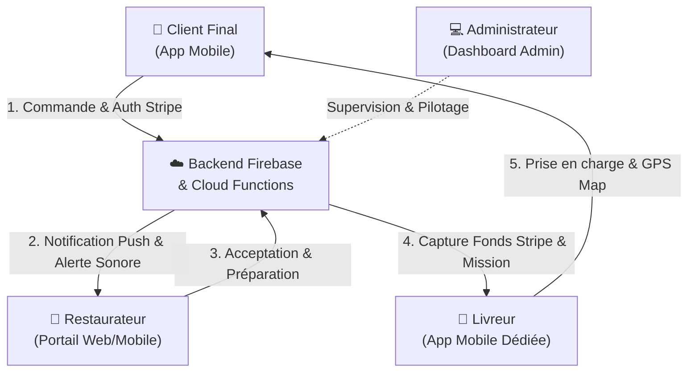
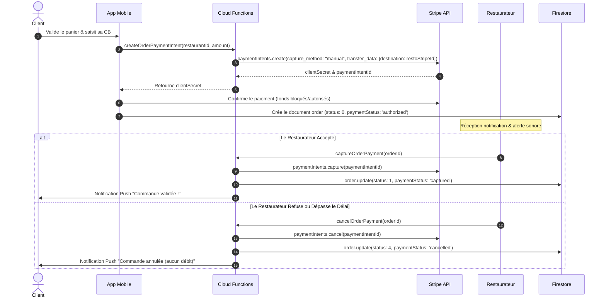

# 🍔 GRAND LIVRE DU CONTEXTE OPENFOOD (MASTER CONTEXT)
### *Plateforme Éco-Responsable de Commande & Livraison de Repas en Martinique & Caraïbes*
*Version : 1.0.0 — Rédigé par le Doc-Agent & le Collège des Agents Experts de Cooking Data*

---

## 🏛️ 1. Vision Métier & Présentation du Projet

### 1.1. Identité & Positionnement
- **Nom du Projet :** **OpenFood**
- **Secteur :** FoodTech, Logistique de livraison locale & Restauration connectée.
- **Territoire Pilote :** **Martinique 🇲🇶 & Zone Caraïbes**
- **Promesse de Valeur :**
  - Une application mobile ultra-fluide permettant aux clients de commander auprès de leurs restaurants locaux préférés.
  - Une logistique optimisée avec attribution intelligente des livreurs et limitation des distances de livraison.
  - Un portail dédié pour chaque restaurateur avec gestion en direct des commandes (temps de préparation, son d'alerte, stock).
  - Un back-office administrateur pour le pilotage global (statistiques, carrousels, codes promo, gestion des comptes).

### 1.2. Les 4 Acteurs Clés de l'Écosystème


---

## 🧱 2. Cartographie Technique de l'Écosystème Monorepo

```
workspaces/openfood/
├── apps/
│   ├── mobile/          # Application Flutter Client & Livreur (iOS / Android / Web)
│   ├── admin/           # Dashboard Flutter Web & Desktop pour l'Administration
│   └── restaurateur/    # Portail Flutter Web/Mobile pour les Restaurateurs Partenaires
├── packages/
│   └── openfood_models/ # Bibliothèque Dart partagée des modèles de données
├── backend/
│   ├── functions/       # Cloud Functions Firebase (Node.js) & Stripe Connect
│   └── firestore.rules  # Règles de sécurité Firestore RBAC
├── docs/                # Grand Livre de Contexte & Spécifications
├── .gitignore           # Filtrage rigoureux des artefacts & builds
└── README.md            # Guide d'onboarding & démarrage rapide
```

---

## 🗄️ 3. Dictionnaire des Données & Schéma Firestore

### 3.1. Collections Principales

| Collection Firestore | Modèle Dart (`openfood_models`) | Description |
| :--- | :--- | :--- |
| `restaurants` | `RestaurantModel` | Profils restaurants (nom, adresse, coordonnées GPS, statut ouvert/fermé, temps moyen de livraison, `stripeAccountId`, note, image). |
| `products` | `ProductModel` | Catalogue de plats et boissons (nom, prix, description, options/suppléments, allergènes, catégorie, `restaurantId`, `isAvailable`). |
| `orders` | `OrderModel` | Commandes complètes (lignes de commande, sous-total, frais de livraison, code promo appliqué, pourboire, statut [0: En attente, 1: En préparation, 2: Prête, 3: En livraison, 4: Livrée/Annulée], `stripePaymentIntentId`, `paymentStatus`). |
| `users` | `AppUser` / `UserModel` | Comptes utilisateurs (nom, email, téléphone, adresses enregistrées, rôle [client, restaurateur, livreur, admin], `fcmToken`). |
| `inventory` | `InventoryItem` | Gestion de l'état des stocks d'ingrédients ou articles critiques par restaurant. |
| `promotions` | `Promotion` | Codes de réduction (code, pourcentage ou montant fixe, date de validité, seuil minimum, historique d'utilisation). |
| `carousels` | `CarouselModel` | Bannières promotionnelles et visuels défilants sur l'écran d'accueil client. |
| `analytics_events` | `AnalyticsEvent` | Télémétrie d'usage, clics sur bannières, conversions paniers et abandons. |

---

## 💳 4. Architecture Financière : Flux de Paiement Stripe Connect

OpenFood utilise le modèle **Stripe Connect avec Destination Charges et Capture Manuelle** :



---

## 🛡️ 5. Matrice de Sécurité & Règles Firestore

1. **Isolation des Rôles :**
   - **Client :** Lecture libre des restaurants et produits disponibles ; écriture/lecture de ses propres commandes et adresses.
   - **Restaurateur :** Lecture/écriture sur ses propres produits, menus et commandes associées à son `restaurantId`.
   - **Livreur :** Lecture des commandes assignées ou disponibles dans son rayon d'action géographique.
   - **Admin :** Accès global à toutes les collections et dashboards analytiques.
2. **Protection des Clés & Secrets :**
   - La clé secrète Stripe (`STRIPE_SECRET_KEY`) est strictement confinée côté serveur dans les Cloud Functions.
   - La clé publiable Stripe (`STRIPE_PUBLISHABLE_KEY`) est initialisée dans le code Flutter.

---

## 🚀 6. Guide de Démarrage & Commandes Utiles

### 6.1. Installation des Dépendances
```bash
# Dans chaque application :
cd apps/mobile && flutter pub get
cd ../admin && flutter pub get
cd ../restaurateur && flutter pub get
cd ../../packages/openfood_models && flutter pub get
```

### 6.2. Lancement en Développement
- **Mobile (simulateur iOS / Android) :** `cd apps/mobile && flutter run`
- **Portail Admin (Chrome) :** `cd apps/admin && flutter run -d chrome`
- **Portail Restaurateur (Chrome) :** `cd apps/restaurateur && flutter run -d chrome`
- **Émulateurs Firebase / Functions :** `cd backend/functions && npm install && npm run serve`
